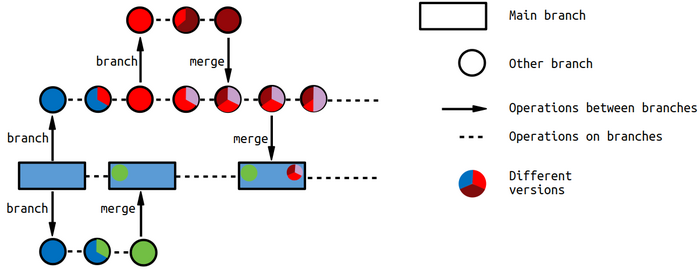

## What is a Branch?

A Git branch represents an independent line of development within a project. Branches are lightweight, movable pointers to a specific commit, allowing developers to diverge from the main line of development and work on new features or bug fixes without affecting the main codebase. 

<center>



</center>

### Viewing Branches

Type `git branch --all` to see all the local branches, including the read-only copies of your remote branches (you can add the `--all` option or just `-a`).

```sh
git branch --all
* main
  remotes/origin/HEAD -> origin/main
  remotes/origin/main
```

> The `--all` and `-a` are actually synonyms for the branch command. Git often provides a verbose and a short option.


### Creating branches

Type `git branch <name>` to create a new branch.


### Switching branches

Type `git switch <name>` to switch branches.

```sh
$ git switch test
Switched to branch 'test'
```

### Merging Branches
The `git merge` command lets you take the commits(or changes) created on a git branch and integrate them into the target branch.

##### For example:
```sh
git merge <BRANCH-NAME>
```