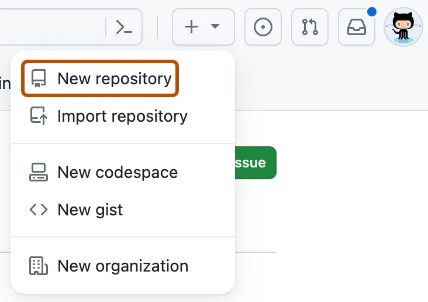

## What is a Repository?

A repository is the most basic element of GitHub. It is easiest to imagine as a project's folder. However, unlike an ordinary folder on your laptop, a GitHub repository offers simple yet powerful tools for collaborating with others.


Location where GitHub displays the files included in the repository. GitHub also displays an About section, the most recent commit in history and the current working branch (there could be more to display as well depending on repository settings).


Tickets to track bugs and feature requests. Issues can be assigned to specific team members and are designed to encourage discussion and collaboration.


Pull requests represent a change, such as adding, modifying, or deleting files, which the author would like to make to files on the repository. Pull Requests enable collaboration through conversations and pull request reviews.


Kanban style boards that all you to visualize your work. Projects can be created at the repository or organization level.


Wikis are to communicate project details, display user documentation, or almost anything your heart desires. GitHub utilizes git to help keep track of the edits to the Wiki in version control.

### Files to keep in Your GitHub Repository as a best practice:

- **README.md**
    - File that should live in your repositories contents. GitHub looks for this file and helpfully displays it below the repository. The README can explain the project and point readers to helpful information within the project.
- **CONTRIBUTING.md**
    - File that describes the process for collaboration on a repository. A link to the CONTRIBUTING.md file is shown when a user attempts to create a new issue or pull request.
- **ISSUE_TEMPLATE.md**
    - File (and its twin the pull request template) used to generate templated starter text for your project issues. Any time someone opens an issue, the content in the template will be pre-populated in the issue body.

---

## Creating Repositories

### GitHub Web

GitHub repositories store a variety of projects. In this guide, you'll create a repository and commit your first change.

1.  In the upper-right corner of any page, select , then click New repository.

    

2.  Type a short, memorable name for your repository. For example, "hello-world".

    

3.  Optionally, add a description of your repository. For example, "My first repository on GitHub."

4.  Choose a repository visibility. For more information, see "[About repositories](https://docs.github.com/en/repositories/creating-and-managing-repositories/about-repositories#about-repository-visibility)."

5.  Select Initialize this repository with a README.

6.  Click Create repository.

Congratulations! You've successfully created your first repository, and initialized it with a *README* file.

### GitHub CLI

#### gh repo create

```
gh repo create [<name>] [flags]

```

Creates a new GitHub repository.

To create a repository interactively, use `gh repo create` with no arguments.

To create a remote repository non-interactively, supply the repository name and one of `--public`, `--private`, or `--internal`. Pass `--clone` to clone the new repository locally.

To create a remote repository from an existing local repository, specify the source directory with `--source`. By default, the remote repository name will be the name of the source directory. Pass `--push` to push any local commits to the new repository.